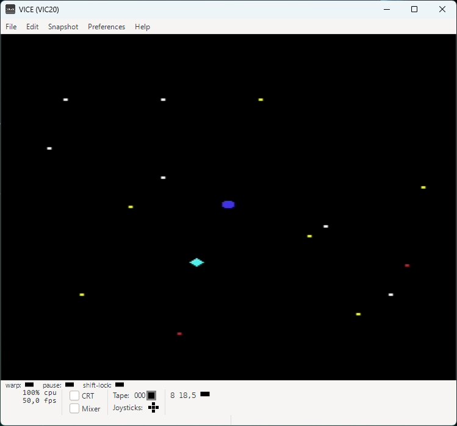
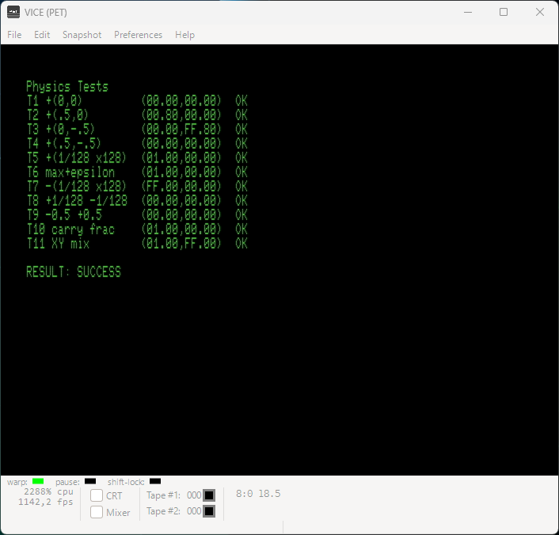
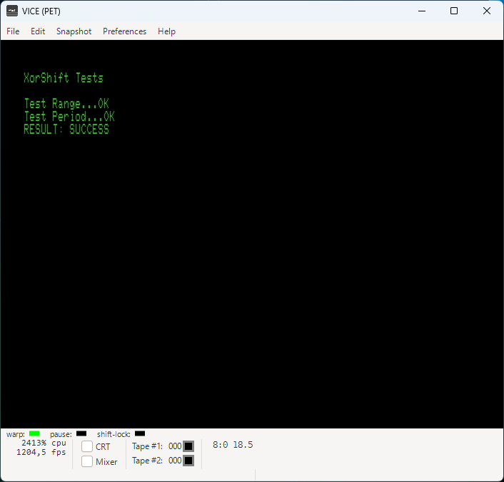

# VIC20UnitTests
Vic-20 assembly application with unit tests written in C and executed in VICE.

## License
Copyright (c) 2026 Fabio Carignano
SPDX-License-Identifier: MIT

See [LICENSE](LICENSE) file for details.

## Overview
This repository demonstrates how modern software engineering practices can be applied to retro computing from the eighties.

The target platform is the Commodore VIC-20, but the approach can be adapted to other Commodore 8-bit machines.

Unit tests run on the Commodore PET 8032 (instead of the VIC-20) to take advantage of its 80-column display for better test output visibility.

## Technologies
- **Application**: 6502 assembly (ca65 assembler)
- **Unit tests**: C (cc65 compiler)
- **Emulator**: VICE for Windows
- **Build system**: GNU make (Windows command prompt)

Versions used are:
- cc65 V2.19
- VICE 3.10 (GTK3VICE-3.10-win64)
- GNU Make 4.4.1

All tools must be in the path.

## The Example Program
StarWanderer, a 2D spacecraft flight simulator.
The physics computation library and the random number generator are covered by unit tests.

**Controls:**
- **W A S D**: throttle in cardinal directions
- **B**: emergency brake

## The Unit Tests
Tests cover the public functions of the physics module and the xorshift random number generator.

Test progress and results are displayed on the PET console.
Upon successful completion, a marker file is created on the host system.  
GNU Make uses this file to verify that the test step succeeded.

VICE is configured to map device 8 to the current host folder.

## Third-Party Components
This project uses components from the following open-source projects:

* **cc65 compiler suite**: The file `pet-tests.cfg` is a modified version of the original linker configuration from [cc65](https://github.com/cc65/cc65).
  * License: **zlib** (SPDX-License-Identifier: Zlib)
