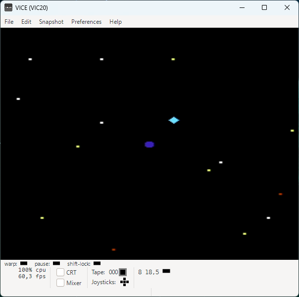

# VIC20UnitTests
Vic-20 assembly application with unit tests written in C and executed as part of the build process.

## License
Copyright (c) 2026 Fabio Carignano
SPDX-License-Identifier: MIT

See [LICENSE](LICENSE) file for details.

## Overview
This repository demonstrates how modern software engineering practices can be applied to retro computing systems from the eighties.

The target platform is the Commodore VIC-20, but the approach can be adapted to other Commodore 8-bit machines.

Unit tests run on the sim65 simulator from the cc65 toolchain, allowing integration with standard build tools and automated workflows.

## Technologies
- **Application**: 6502 assembly (ca65 assembler)
- **Unit tests**: C (cc65 compiler, sim65 simulator)
- **Emulator**: VICE for Windows
- **Build system**: GNU Make (Windows command prompt)

Versions used:
- cc65 V2.19
- GNU Make 4.4.1
- VICE 3.10 (GTK3VICE-3.10-win64)

All tools must be available in the system PATH.

## The Example Program
StarWanderer, a 2D spacecraft flight simulator.

The physics module and the random number generator (xorshift) are covered by unit tests.

**Controls:**
- **W A S D**: throttle in cardinal directions
- **B**: emergency brake

## The Unit Tests
Tests cover the public functions of the physics module and the xorshift random number generator.

Tests are executed as part of the build process.  
Output is written to files and used by GNU Make to determine whether the test step completed successfully.
